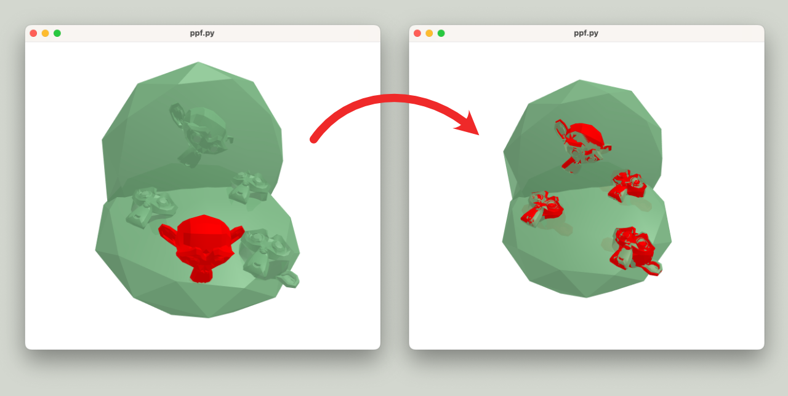
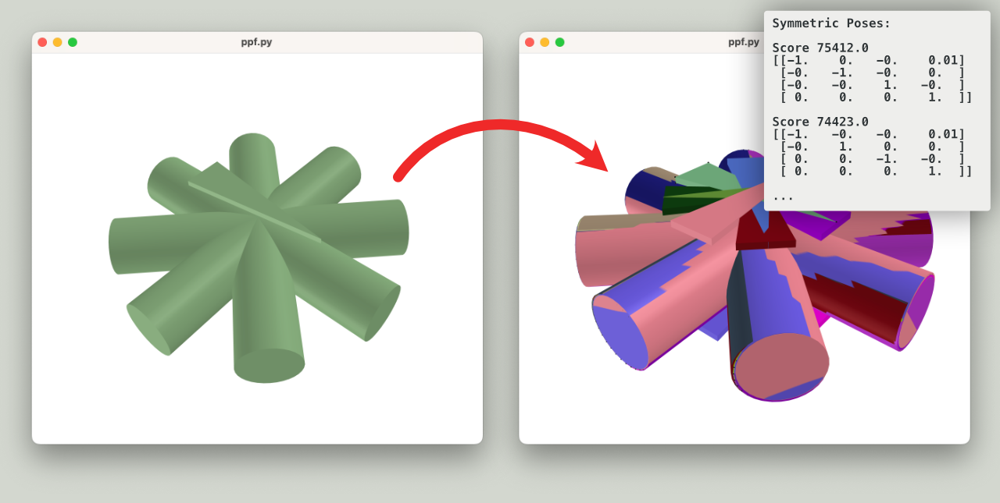

# Model Globally, Match Locally: Efficient and Robust 3D Object Recognition

> Small python implementation of the paper "Model Globally, Match Locally: Efficient and Robust 3D Object Recognition"
> by Drost. et al (2010) [[paper]](https://campar.in.tum.de/pub/drost2010CVPR/drost2010CVPR.pdf).
>
> Use the `--fast` flag to use the binary extension (see instructions below)
>
> Please note that the algorithm has been [patented by MVTec GmbH](https://patents.google.com/patent/EP2385483B1/).



# Usage

```
$ python3 ppf.py --help                                                                                        
usage: ppf.py [-h] [--fast] [--scene-pts-fraction SCENE_PTS_FRACTION] [--ppf-num-angles PPF_NUM_ANGLES] [--ppf-rel-dist-step PPF_REL_DIST_STEP] [--alpha-num-angles ALPHA_NUM_ANGLES]
              [--cluster-max-angle CLUSTER_MAX_ANGLE]
              model scene

This script computes the point-pair features of a given
model and tries to find the model in a given scene.

Note: Currently, trimesh doesn't support pointcloud with normals. To combat this, you need to
      reconstruct some surface between the points (e.g. ball pivoting)

positional arguments:
  model                 Path to the model pointcloud
  scene                 Path to the scene pointcloud

options:
  -h, --help            show this help message and exit
  --fast                Use the c++ extension for speeeeeed
  --scene-pts-fraction SCENE_PTS_FRACTION
                        Fraction of scene points to use as reference
  --ppf-num-angles PPF_NUM_ANGLES
                        Number of angle steps used to discretize feature angles.
  --ppf-rel-dist-step PPF_REL_DIST_STEP
                        Discretization step of feature distances, relative to model diameter.
  --alpha-num-angles ALPHA_NUM_ANGLES
                        Number of angle steps used to discretize the rotation angle alpha.
  --cluster-max-angle CLUSTER_MAX_ANGLE
                        Maximal angle between poses after which they don't belong to same cluster anymore. [degrees]
```

# Object Symmetry Extraction

> Another neat thing you can do with PPF-Voting is figuring out object symmetries. You simply give the mesh
> of your model (or a resampled version of it) to `ppf.py` and it will figure out the rest.
> You'd probably want to combine it with ICP though.



# Gotchas

- This is very much an exploratory implementation to understand the paper. No guarantees for correctness, no speed.
- As `trimesh` currently doesn't support point clouds with normals, input need to be meshes
- Currently, the code does no resampling of the input meshes, so preprocess them
- There are probably some mistakes still in the code, I discover more every now and then

# C++ Extension via nanobind

To get much faster processing times, compile the binary extension. To do so,
make sure you have Eigen installed on your system, a C++ compiler, CMake, etc. Then:

```
# to load nanobind and its dependencies
git submodule update --init --recursive
mkdir build
cd build
cmake ..
make
```

Additionally, symlink the resulting `.so` to the main folder. Now you should be able to
run `ppf.py` with the `--fast` option.
